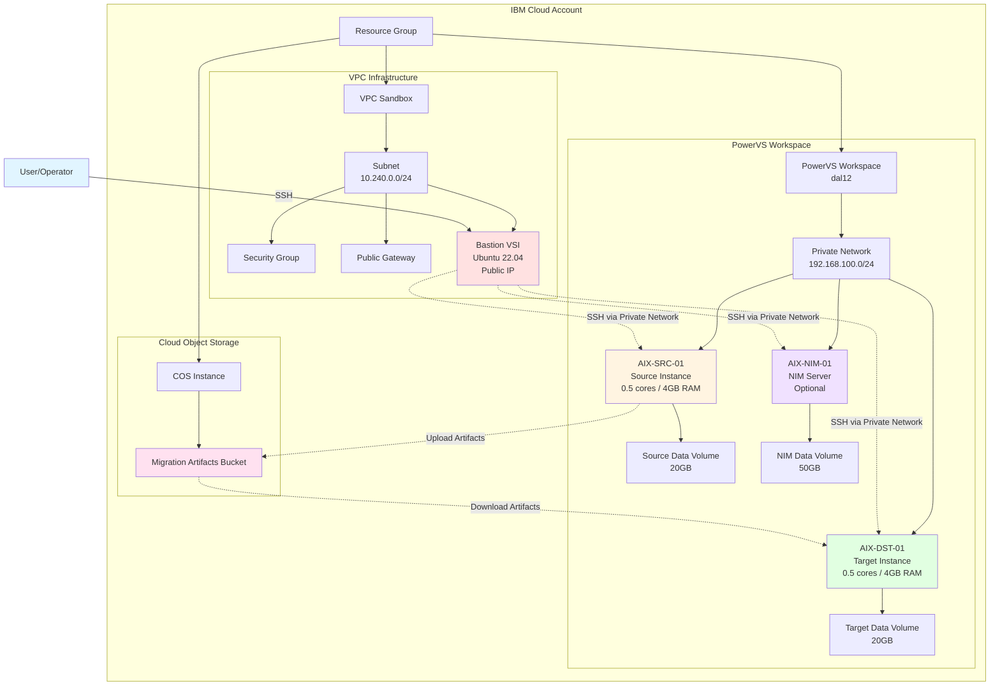

# Architecture Documentation

## Overview

This document describes the architecture of the Power Migration Lab sandbox environment provisioned by this Terraform project.

## Architecture Diagram

## Components

### 1. Resource Group

**Purpose**: Logical container for all resources in the sandbox.

**Configuration**:
- Can be created new or use existing
- All resources are tagged for easy identification
- Provides cost tracking and access control boundary

### 2. VPC Infrastructure

#### VPC (Virtual Private Cloud)
**Purpose**: Isolated network environment for the bastion/staging server.

**Configuration**:
- Region: Configurable (default: us-south)
- Zone: Configurable (default: us-south-1)
- Address prefix: 10.240.0.0/16
- Subnet CIDR: 10.240.0.0/24

#### Security Group
**Purpose**: Firewall rules for the bastion VSI.

**Default Rules**:
- Inbound: SSH (port 22) from specified CIDR
- Outbound: All traffic allowed

**Security Considerations**:
- Restrict `allowed_ssh_cidr` to your IP address in production
- Consider adding additional rules for specific services
- Review and audit security group rules regularly

#### Public Gateway
**Purpose**: Provides internet access for the VPC subnet.

**Use Cases**:
- Bastion VSI can download packages and updates
- Access to IBM Cloud services
- Upload/download to Cloud Object Storage

#### Bastion VSI
**Purpose**: Jump host for accessing PowerVS instances and staging area for migration artifacts.

**Specifications**:
- OS: Ubuntu 22.04 LTS (minimal)
- Profile: cx2-2x4 (2 vCPUs, 4GB RAM)
- Storage: Boot volume only
- Network: Private IP + Public Floating IP

**Use Cases**:
- SSH jump host to AIX instances
- Staging area for migration scripts
- Ansible control node
- File transfer staging
- Monitoring and logging

### 3. Cloud Object Storage (COS)

#### COS Instance
**Purpose**: Object storage service for migration artifacts.

**Configuration**:
- Plan: Standard (pay-as-you-go)
- Location: Global
- Versioning: Enabled for safety

#### Migration Artifacts Bucket
**Purpose**: Store mksysb, savevg, and other migration artifacts.

**Configuration**:
- Storage class: Standard (configurable)
- Region: Same as VPC region
- Versioning: Enabled
- Activity tracking: Enabled

**Use Cases**:
- Store mksysb images from source
- Store savevg backups
- Store migration scripts and logs
- Archive for compliance and rollback

**Best Practices**:
- Use lifecycle policies for old artifacts
- Enable encryption at rest
- Monitor storage usage and costs
- Implement retention policies

### 4. PowerVS Workspace

#### PowerVS Service Instance
**Purpose**: Container for PowerVS resources (instances, networks, volumes).

**Configuration**:
- Datacenter: Configurable (default: dal12)
- Zone: Configurable (default: us-south)
- Plan: power-virtual-server-group

**Available Datacenters**:
- US: dal12, dal13, us-east
- Europe: lon04, lon06, fra04, fra05
- Asia Pacific: syd04, syd05, tok04
- Canada: mon01, tor01

#### Private Network
**Purpose**: Isolated network for AIX instances.

**Configuration**:
- Type: VLAN
- CIDR: 192.168.100.0/24 (configurable)
- DNS: 9.9.9.9, 1.1.1.1 (configurable)

**Network Isolation**:
- No direct internet access
- Access only via bastion host
- Simulates on-premises network

#### AIX Source Instance (AIX-SRC-01)
**Purpose**: Simulates the source AIX system to be migrated.

**Specifications**:
- Image: AIX 7.3 TL2 (configurable)
- Processors: 0.5 (shared)
- Memory: 4GB
- System Type: s922
- Storage Pool: Tier3 (configurable)

**Volumes**:
- Boot volume: Created automatically from image
- Data volume: 20GB additional volume (simulates datavg/appvg)

**Use Cases**:
- Install sample applications
- Create test data
- Generate mksysb and savevg
- Test backup procedures

#### AIX Target Instance (AIX-DST-01)
**Purpose**: Destination system for migration.

**Specifications**:
- Image: AIX 7.3 TL2 (same as source)
- Processors: 0.5 (shared)
- Memory: 4GB
- System Type: s922
- Storage Pool: Tier3 (configurable)

**Volumes**:
- Boot volume: Created automatically from image
- Data volume: 20GB additional volume (for restore)

**Use Cases**:
- Restore mksysb from source
- Restore savevg from source
- Validate migrated system
- Test applications post-migration

#### AIX NIM Instance (AIX-NIM-01) - Optional
**Purpose**: Network Installation Management server for AIX.

**Specifications**:
- Image: AIX 7.3 TL2
- Processors: 0.5 (shared)
- Memory: 4GB
- System Type: s922
- Storage Pool: Tier3

**Volumes**:
- Boot volume: Created automatically
- Data volume: 50GB (for NIM resources)

**Use Cases**:
- Alternative migration method using NIM
- Centralized AIX management
- Network-based installations
- Resource repository

**Note**: NIM instance is optional and controlled by `create_nim` variable.

## Network Flow

### SSH Access Flow
1. User connects to Bastion public IP via SSH
2. From Bastion, user can SSH to AIX instances using private IPs
3. All AIX-to-AIX communication happens on private network

### Migration Artifact Flow
1. Generate mksysb/savevg on AIX-SRC-01
2. Transfer artifacts from AIX-SRC-01 to Bastion (via SCP/SFTP)
3. Upload artifacts from Bastion to COS bucket
4. Download artifacts from COS bucket to Bastion
5. Transfer artifacts from Bastion to AIX-DST-01
6. Restore on AIX-DST-01

### Alternative Flow (Direct COS Access)
If AIX instances have COS CLI tools installed:
1. Generate mksysb/savevg on AIX-SRC-01
2. Upload directly to COS bucket using IBM Cloud CLI
3. Download directly from COS bucket to AIX-DST-01
4. Restore on AIX-DST-01

## Storage Architecture

### PowerVS Storage Pools

**Tier1 (Flash)**:
- High performance SSD storage
- Lower latency
- Higher cost
- Best for: Production workloads, databases

**Tier3 (HDD)**:
- Standard performance
- Higher latency
- Lower cost
- Best for: Development, testing, archives

**Recommendation for Sandbox**: Use Tier3 to minimize costs.

### Volume Management

**Boot Volumes**:
- Created automatically from AIX image
- Size determined by image
- Contains rootvg

**Data Volumes**:
- Created separately
- Attached to instances
- Must be configured in AIX (not done by Terraform)
- Simulates application/data volume groups

## Sizing Considerations

### Minimum Configuration (Sandbox)
- AIX Instances: 0.5 cores, 4GB RAM each
- Data Volumes: 20GB each
- Bastion: cx2-2x4 (2 vCPUs, 4GB RAM)

### Recommended for Testing
- AIX Instances: 1.0 cores, 8GB RAM each
- Data Volumes: 50GB each
- Bastion: cx2-4x8 (4 vCPUs, 8GB RAM)

### Production-Like Environment
- AIX Instances: 2+ cores, 16GB+ RAM each
- Data Volumes: Based on actual data size
- Bastion: bx2-4x16 or larger
- Consider Tier1 storage for performance

## Security Architecture

### Network Security
- VPC isolated from PowerVS
- PowerVS private network isolated
- No direct internet access to AIX instances
- Bastion as single entry point

### Access Control
- SSH key-based authentication only
- Security group restricts inbound access
- Resource group for RBAC
- IAM policies for service access

### Data Security
- COS bucket versioning enabled
- Activity tracking for audit
- Encryption at rest (IBM-managed keys)
- Consider BYOK for production

## High Availability Considerations

**Note**: This is a sandbox environment and does NOT include HA features.

For production migrations, consider:
- Multiple availability zones
- Load balancers
- Backup and disaster recovery
- Monitoring and alerting
- Redundant network paths

## Cost Optimization

### Sandbox Cost Factors
1. **PowerVS Instances**: Charged per core-hour and GB-hour
2. **PowerVS Storage**: Charged per GB-month
3. **VPC Resources**: Bastion VSI, floating IP, gateway
4. **COS**: Storage and API calls
5. **Data Transfer**: Egress charges

### Cost Reduction Tips
- Use shared processors (not dedicated)
- Use Tier3 storage
- Stop instances when not in use
- Delete old artifacts from COS
- Use smallest viable instance sizes
- Set up budget alerts

### Estimated Monthly Cost (Sandbox)
- PowerVS (2-3 instances, 24x7): ~$150-250
- VPC (Bastion): ~$30-50
- COS: ~$5-20
- **Total**: ~$185-320/month

**Note**: Costs vary by region and usage. Stop instances when not testing to reduce costs.

## Limitations

### Sandbox vs Production
This sandbox environment has several limitations compared to a real migration:

1. **Source System**: Also in PowerVS (not on-premises)
2. **Network**: Simplified, no complex routing
3. **Storage**: No SAN, VIOS, or multipathing
4. **Scale**: Small instances and volumes
5. **Applications**: No real applications or dependencies
6. **Monitoring**: No enterprise monitoring tools
7. **Backup**: No enterprise backup solutions
8. **Change Management**: No formal change process

See [sandbox-vs-real-environment.md](sandbox-vs-real-environment.md) for detailed comparison.

## Next Steps

After infrastructure is provisioned:

1. **Validate Connectivity**
   - SSH to bastion
   - SSH from bastion to AIX instances
   - Test COS access

2. **Configure AIX Systems** (via Ansible)
   - Create volume groups on data volumes
   - Create filesystems
   - Install required packages
   - Configure network settings

3. **Prepare Source System**
   - Install sample application
   - Create test data
   - Document configuration

4. **Test Migration Process**
   - Generate mksysb
   - Generate savevg
   - Transfer to COS
   - Restore on target
   - Validate

5. **Document Lessons Learned**
   - What worked well
   - What challenges were encountered
   - Recommendations for production

## References

- [IBM Power Virtual Server Documentation](https://cloud.ibm.com/docs/power-iaas)
- [IBM VPC Documentation](https://cloud.ibm.com/docs/vpc)
- [IBM Cloud Object Storage Documentation](https://cloud.ibm.com/docs/cloud-object-storage)
- [AIX Documentation](https://www.ibm.com/docs/en/aix/)
- [Terraform IBM Provider](https://registry.terraform.io/providers/IBM-Cloud/ibm/latest/docs)